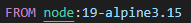
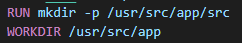
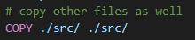
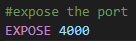
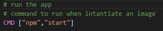

# Introducción
Este documento tiene como finalidad explicar el Dockerfile
# Contenido
Esta línea indica que la imagen base para este contenedor es la versión 19 de Node.js en Alpine Linux 3.15. Una imagen base es una imagen de Docker existente que se utiliza como punto de partida para construir una nueva imagen.

Estas dos líneas crean un nuevo directorio llamado **/usr/src/app/src** y establecen el directorio de trabajo actual en **/usr/src/app**. El comando **mkdir -p** crea un directorio en caso de que no exista, y el modificador **-p** hace que se creen también los directorios padre necesarios.

Estas dos líneas copian el archivo **package.json** del sistema de archivos local al contenedor y luego ejecutan **npm install** dentro del contenedor para instalar todas las dependencias especificadas en el archivo package.json. Esto es necesario para que la aplicación pueda ejecutarse dentro del contenedor.

Esta línea copia todos los archivos del directorio **./src/** del sistema de archivos local al directorio ./src/ dentro del contenedor. Esta línea asegura que todos los archivos necesarios para que la aplicación se ejecute estén disponibles dentro del contenedor.

Esta línea expone el puerto **4000** del contenedor. Exponer un puerto permite que otros contenedores o máquinas puedan conectarse a la aplicación que se está ejecutando dentro del contenedor.

Esta línea establece el comando predeterminado que se ejecutará cuando se inicie el contenedor. En este caso, se ejecutará el comando **npm start,** que iniciará la aplicación. npm start se ejecutará dentro del directorio de trabajo actual del contenedor, que es /usr/src/app.

