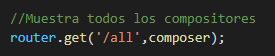
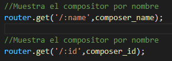
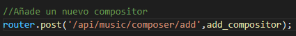
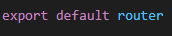

# Introducción
Este documento tiene como finalidad explicar el código de src/routes/composer.routes.js
# Contenido
Primero, se importan los módulos Router y los controladores indexRoutes.js. 

A continuación, se crea una constante router que contiene una instancia Router. 

Después, se muestra todos los compositores con la ruta "/all" mediante el método GET. 

Se puede mostrar el compositor por nombre y por id con los métodos GET correspondientes.

` `Finalmente, se añade un nuevo compositor con el método POST y la ruta "/api/music/composer/add". 

Se exporta el router como el elemento principal para generar el documento

