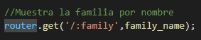
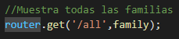
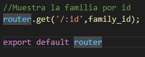

# Introducción
Este documento tiene como finalidad explicar el código de src/routes/family.routes.js
# Contenido
La primera línea importa el módulo Router desde la biblioteca Express. El Router es un objeto que nos permite definir diferentes rutas para nuestra aplicación.

A continuación, la línea importa los controladores necesarios para gestionar las peticiones de la API. Estos controladores están definidos en el archivo src/controllers/indexRoutes.js.

En la siguiente línea se crea una constante llamada router que contiene una instancia del Router de Express. Esto significa que se ha creado un objeto que nos permitirá definir las rutas de nuestra aplicación.

A continuación se define la primera ruta. Esta ruta es accesible mediante una petición GET a la URL '/:family'. Esto significa que el usuario podrá solicitar la información de una familia específica pasando como parámetro el nombre de la familia. El manejo de esta petición está definido en el controlador family\_name.

La segunda ruta es accesible mediante una petición GET a la URL '/all'. Esta petición devolverá la información de todas las familias registradas en la aplicación. El manejo de esta petición está definido en el controlador family.

Finalmente, la tercera ruta es accesible mediante una petición GET a la URL '/:id'. Esta petición devolverá la información de una familia específica pasando como parámetro el id

