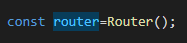
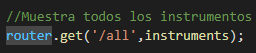
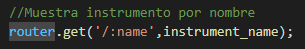
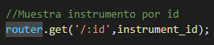
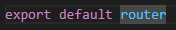

# Introducción
Este documento tiene como finalidad explicar el código de src/routes/instrument.routes.js
# Contenido
Estas líneas importan el objeto Router de Express, así como tres controladores (handlers) llamados instrument\_id, instrument\_name, y instruments del archivo indexRoutes.js ubicado en la carpeta controllers.

Esta línea crea una instancia del objeto Router de Express, que es utilizado para manejar las diferentes rutas de URL de la API.

Esta línea establece una ruta para manejar una solicitud GET a la URL instruments/all. Cuando se recibe una solicitud GET a esta URL, el controlador instruments es invocado para procesar la solicitud y devolver todos los instrumentos.

Esta línea establece una ruta para manejar una solicitud GET a la url instruments/. Cuando se recibe la solicitud GET con una URL que contenga un parámetro name, el controlador instrument\_name es invocado para procesar la solicitud y devolver una respuesta con el instrumento indicado.

Esta línea establece una ruta para manejar una solicitud GET a la url instruments/. Cuando se recibe la solicitud GET con una URL que contenga un parámetro id, el controlador instrument\_id es invocado para procesar la solicitud y devolver una respuesta con el instrumento indicado.

Finalmente, esta línea exporta el objeto router para que pueda ser utilizado por otros módulos de la aplicación.

