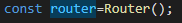
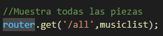
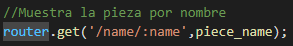
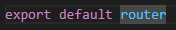

# Introducción
Este documento tiene como finalidad explicar el código de src/routes/pieces.routes.js
# Contenido
Este código define un conjunto de rutas para la API de Contemporánica que se encuentran bajo la ruta "/api/music".

El primer paso es importar el módulo "Router" desde el paquete "express" de Node.js. Este módulo se utiliza para crear un enrutador que se puede utilizar para definir rutas en la aplicación.

Luego, se importan dos controladores (musiclist y piece\_name) desde el archivo "indexRoutes.js" dentro de la carpeta "controllers". Estos controladores se encargan de procesar las solicitudes realizadas a las rutas definidas.

Se crea un objeto "router" utilizando el método "Router()" que se obtiene al importar el módulo Router desde express. Este objeto se utilizará para definir las rutas de la API.

A continuación, se definen dos rutas utilizando el objeto router. 

La primera ruta es para mostrar todas las piezas y se utiliza el método "get" de Express.js para escuchar las solicitudes HTTP GET a la ruta "/all". La función controladora "musiclist" se utiliza para procesar la solicitud y devolver una respuesta.

La segunda ruta es para mostrar la pieza por nombre. Se utiliza el método "get" de Express.js para escuchar las solicitudes HTTP GET a la ruta "/name/:name". El parámetro ":name" en la ruta se utilizará para recibir el nombre de la pieza que se desea buscar. La función controladora "piece\_name" se utiliza para procesar la solicitud y devolver una respuesta.

Finalmente, esta línea exporta el objeto router para que pueda ser utilizado por otros módulos de la aplicación.

